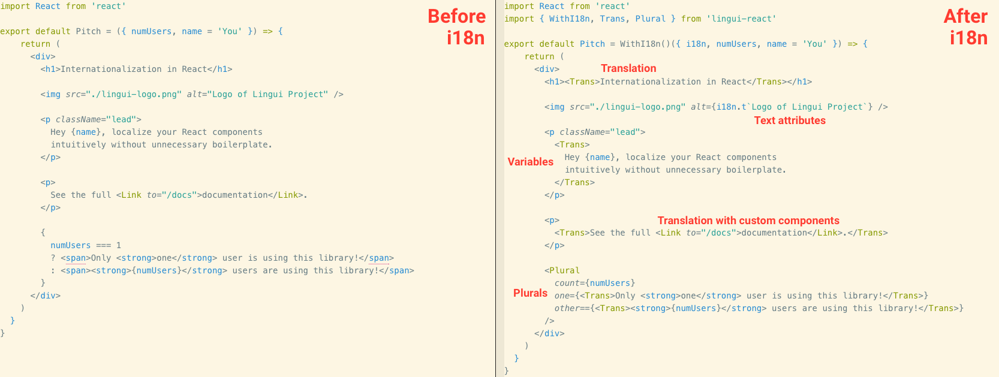

# Lingui - tools for ~~internationalization~~ i18n in javascript

Type-checked and intuitive way to internationalize applications in Javascript 
and ReactJS.

> Internationalization is the design and development of a product, application or document content that enables easy localization for target audiences that vary in culture, region, or language.
>
> --- [ W3C Web Internationalization FAQ](https://www.w3.org/International/questions/qa-i18n)

Building applications and products for international audiences involves internationalization (i.e: preparing app for translation) and localization (i.e: adoption of application to meet language and cultural requirements). Lingui provides tools to make i18n process easy and automated.

## Key features

- Small and fast - about 6kb gzipped (no hacks with `webpack.IgnorePlugin` required, no message parsing in production)
- Built on standard ICU MessageFormat (might replace react-intl completely)
  - Variable interpolation
  - Components inside translations (e.g: `Read <Link to="...">documentation</Link>.`)
  - Plurals, Ordinals and Categories (i.e. Select)
  - Number and Date formats (from Intl)
- Works with manual and generated message IDs
- Works in React and Vanilla JS (e.g: in redux-saga, CLI interface, etc.)
- CLI for extracting and compiling message catalogs
- Babel plugin for convenient, type-checked way of writing ICU MessageSyntax (recommended, but not required)
